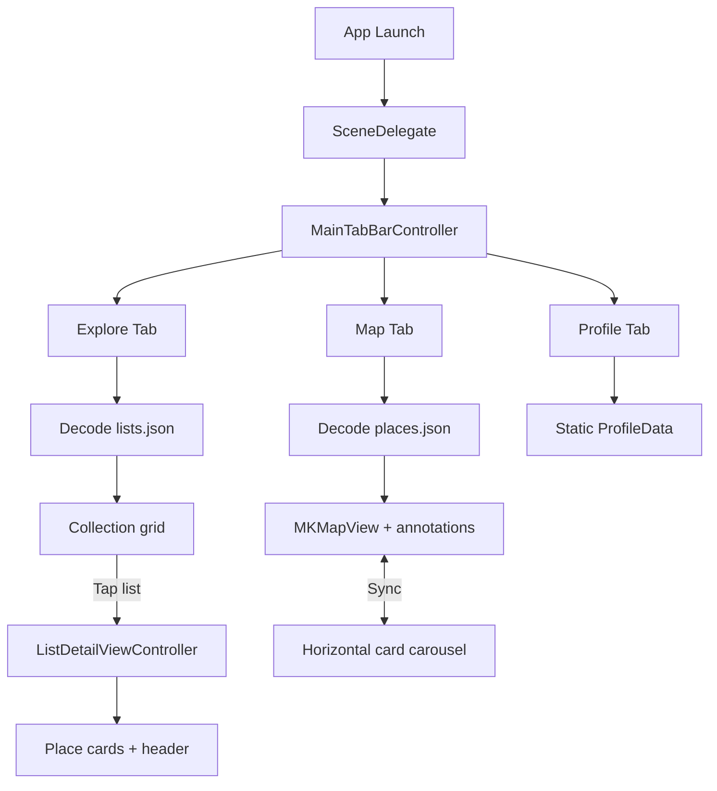

# TravelApp

A native **iOS** travel discovery app built with **UIKit**. Browse curated travel lists, explore places on an interactive map, and view a profile screen—all powered by bundled JSON data and remote images from CloudFront.

---

## Table of Contents

- [Features](#features)
- [Requirements](#requirements)
- [Tech Stack](#tech-stack)
- [Project Structure](#project-structure)
- [Architecture](#architecture)
- [Data Layer](#data-layer)
- [Dependencies](#dependencies)
- [Getting Started](#getting-started)
- [App Flow](#app-flow)
- [Key Components](#key-components)
- [Image Loading](#image-loading)
- [License & Attribution](#license--attribution)

---

## Features

### Explore
- Two-column grid of **travel lists** loaded from `lists.json`
- Each card shows cover image, title, and stats (places, views, saves)
- Tap a list to open **list detail** with:
  - Edge-to-edge cover header (creator, descriptions, stats)
  - Scrollable list of places with ratings and categories
- **Hero** shared-element transitions between grid cover and detail header

### Map
- Full-screen **MapKit** map with custom place markers
- Bottom **horizontal card carousel** synced with map selection
- Interactions:
  - Swipe cards → map pans and marker highlights
  - Tap marker → carousel scrolls to matching place
  - Tap card → re-centers selection
- Haptic feedback on carousel-driven selection
- Camera bias keeps markers visible above the card strip

### Profile
- Scrollable profile UI with avatar, bio, trip stats, and menu rows
- Placeholder actions (edit profile, menu items, sign out) log to console
- Uses in-memory dummy data (not persisted)

---

## Requirements

| Requirement | Version |
|-------------|---------|
| Xcode | Compatible with iOS deployment target below |
| iOS | **26.4+** (as set in `TravelApp.xcodeproj`) |
| Swift | **5.0** |
| macOS | For building and running the Simulator or device |

> **Note:** Open `TravelApp.xcworkspace` (not only the `.xcodeproj`) if you use CocoaPods integration. Swift Package Manager dependencies resolve automatically in Xcode.

---

## Tech Stack

| Layer | Technology |
|-------|------------|
| UI | UIKit (`UITabBarController`, `UINavigationController`, `UICollectionView`, compositional layout) |
| Maps | MapKit (`MKMapView`, custom `MKAnnotationView`) |
| Navigation animations | [Hero](https://github.com/HeroTransitions/Hero) 1.6.4+ |
| Remote images (Explore) | [Kingfisher](https://github.com/onevcat/Kingfisher) 8.9.0+ |
| Placeholders | BlurHash decoder (Wolt MIT implementation, in-app) |
| Data | Local JSON in app bundle |
| Dependency managers | Swift Package Manager (primary), CocoaPods workspace (empty `Podfile`) |

---

## Project Structure

```
TravelApp/
├── README.md
├── Podfile / Podfile.lock          # CocoaPods (no app pods currently)
├── TravelApp.xcworkspace             # Open this in Xcode
├── TravelApp.xcodeproj
└── TravelApp/
    ├── App/
    │   ├── AppDelegate.swift
    │   ├── SceneDelegate.swift       # Sets MainTabBarController as root
    │   ├── HeroNavigationController.swift
    │   └── Core/
    │       ├── BlurHashCache.swift   # BlurHash decode + NSCache
    │       └── UIImageViewCaching.swift  # Kingfisher + blurhash helper
    ├── Tabs/
    │   ├── MainTabBarController.swift
    │   ├── Data/
    │   │   ├── lists.json            # Travel lists for Explore
    │   │   └── places.json           # Map places with coordinates
    │   ├── Explore/
    │   │   ├── Models/TravelList.swift
    │   │   ├── Views/
    │   │   │   ├── ExploreViewController.swift
    │   │   │   └── ListDetailViewController.swift
    │   │   └── Components/
    │   │       ├── ExploreCardCell.swift
    │   │       ├── PlaceCardCell.swift
    │   │       └── ListDetailHeaderView.swift
    │   ├── Map/
    │   │   ├── Models/Place.swift    # MapPlace
    │   │   ├── Views/MapViewController.swift
    │   │   └── Components/
    │   │       ├── CenteredCardLayout.swift
    │   │       ├── MapPlaceCardCell.swift
    │   │       ├── PlaceAnnotation.swift
    │   │       ├── PlaceMarkerView.swift
    │   │       └── ImageLoader.swift
    │   └── Profile/
    │       └── ProfileViewController.swift
    ├── Assets.xcassets
    ├── Base.lproj/LaunchScreen.storyboard
    └── Info.plist
```

---

## Architecture

The app follows a **feature-based folder layout** with UIKit view controllers and reusable collection/table cells. There is no separate networking or persistence layer; data is read once from the bundle at runtime.

```
SceneDelegate
    └── MainTabBarController
            ├── HeroNavigationController → ExploreViewController
            │       └── ListDetailViewController (push)
            ├── HeroNavigationController → MapViewController
            └── HeroNavigationController → ProfileViewController
```

- **Scene lifecycle:** `SceneDelegate` creates the window and assigns `MainTabBarController` as the root.
- **Navigation:** Each tab uses `HeroNavigationController` so push transitions can use Hero IDs (e.g. list cover → detail header).
- **Models:** `Decodable` structs map JSON snake_case keys via `CodingKeys`.
- **No backend:** Lists and map places are static JSON; images load from HTTPS URLs embedded in JSON.

---

## Data Layer

### `lists.json` → `TravelList`

Used by **Explore** and **List Detail**.

| Model | Purpose |
|-------|---------|
| `TravelList` | List metadata, cover photos, stats, nested places |
| `Creator` | List author name and profile photo URL |
| `CoverPhoto` | `small` / `medium` / `large` image URLs |
| `ListStats` | View, place, save, comment, share counts |
| `Place` | Place inside a list (name, rating, categories, cover media) |

Loaded in `ExploreViewController.loadLists()`:

```swift
Bundle.main.url(forResource: "lists", withExtension: "json")
```

### `places.json` → `MapPlace`

Used by **Map** tab only. Includes coordinates, ratings, categories, cover media, and open hours.

Loaded via `MapPlace.loadFromBundle()`:

```swift
Bundle.main.url(forResource: "places", withExtension: "json")
```

### JSON conventions

- Mongo-style `_id` on lists maps to `TravelList.id`
- API-style snake_case fields (`short_description`, `cover_photo`, `place_id`, etc.)
- Remote images hosted on CloudFront (`d3iq0vcqnt2b9k.cloudfront.net`)

Ensure both JSON files are members of the **TravelApp** target so they are copied into the app bundle.

---

## Dependencies

### Swift Package Manager (Xcode)

| Package | Minimum version | Used for |
|---------|-----------------|----------|
| [Hero](https://github.com/HeroTransitions/Hero) | 1.6.4 | Shared-element transitions, navigation controller |
| [Kingfisher](https://github.com/onevcat/Kingfisher) | 8.9.0 | Async image download/cache in Explore |

Resolve packages: **File → Packages → Resolve Package Versions** in Xcode.

### CocoaPods

`Podfile` defines the `TravelApp` target with `use_frameworks!` but **no pods**. The workspace still references `Pods/` for compatibility; run `pod install` only if you add pods later.

### Built-in

- **BlurHash** decoding in `BlurHashCache.swift` (adapted from [Wolt’s MIT implementation](https://github.com/woltapp/blurhash))
- **ImageLoader** — lightweight `URLSession` + `NSCache` used by map cards (separate from Kingfisher)

---

## Getting Started

1. **Clone** the repository to your machine.
2. **Open** `TravelApp.xcworkspace` in Xcode.
3. Wait for **Swift packages** (Hero, Kingfisher) to resolve.
4. Select the **TravelApp** scheme and a simulator or connected device.
5. **Build and run** (⌘R).

### Optional: CocoaPods

If you add dependencies to `Podfile` later:

```bash
cd /path/to/TravelApp
pod install
```

Then reopen `TravelApp.xcworkspace`.

### Bundle identifier

`com.gyaneshwar.eightydays.TravelApp` — update signing team in Xcode under **Signing & Capabilities** for device builds.

### Network

The app loads images over HTTPS. No API keys are required for the bundled JSON flow. A network connection is needed for cover and place photos.

---

## App Flow



---

## Key Components

| Component | Location | Role |
|-----------|----------|------|
| `MainTabBarController` | `Tabs/` | Three tabs: Explore, Map, Profile |
| `HeroNavigationController` | `App/` | Enables Hero on all tab stacks |
| `ExploreViewController` | `Explore/Views/` | 2-column flow layout of lists |
| `ListDetailViewController` | `Explore/Views/` | Compositional layout + section header |
| `ListDetailHeaderView` | `Explore/Components/` | Parallax-style list header with Hero ID |
| `MapViewController` | `Map/Views/` | Map + carousel coordination |
| `CenteredCardLayout` | `Map/Components/` | Snap-to-center horizontal paging |
| `PlaceMarkerView` | `Map/Components/` | Custom circular map pins |
| `PlaceAnnotation` | `Map/Components/` | `MKAnnotation` wrapping `MapPlace` + index |
| `ProfileViewController` | `Profile/` | Profile UI and placeholder actions |

### Map selection logic

`MapViewController` keeps `currentIndex` in sync across:

- `SelectionSource.initial` — first place on layout
- `SelectionSource.mapTap` — annotation tap
- `SelectionSource.collectionScroll` — user swiped carousel
- `SelectionSource.cardTap` — direct card tap

Programmatic carousel scrolls set `isProgrammaticScroll` to avoid feedback loops when the map drives the carousel.

### Hero transition IDs

Explore cards and detail headers share:

```text
"{list.id}cover"
```

Set on `ExploreCardCell` and `ListDetailHeaderView` for matched transitions.

---

## Image Loading

| Area | Mechanism | Placeholder |
|------|-----------|-------------|
| Explore grid / detail | Kingfisher (`kf.setImage` / `setRemoteImage`) | BlurHash via `BlurHashCache` where used |
| Map cards | `ImageLoader.shared` | Local loading state in cell |
| Profile | SF Symbols only | N/A |

`UIImageView.setRemoteImage(urlString:blurhash:targetSize:)` centralizes Kingfisher options: fade transition, cache original image, optional downsampling for thumbnails.

---

## Known Limitations

- **Profile** data is hardcoded; menu and sign-out actions only print to the console.
- **List detail** place tap logs the place name; no further navigation yet.
- **Explore** error log mentions `explore_lists.json` but the bundle file is `lists.json`.
- **No unit/UI tests** in the repository at this time.
- Requires **network** for remote images; JSON works offline.

---

## License & Attribution

- **BlurHash decoder:** Adapted from Wolt’s MIT-licensed [blurhash](https://github.com/woltapp/blurhash) implementation.
- **Hero** and **Kingfisher** are subject to their respective open-source licenses (see package repositories and Xcode’s **Package Dependencies** pane).

---

## Version

- **Marketing version:** 1.0  
- **Created:** May 2026  

For questions or contributions, refer to the source files under `TravelApp/` and this document.
